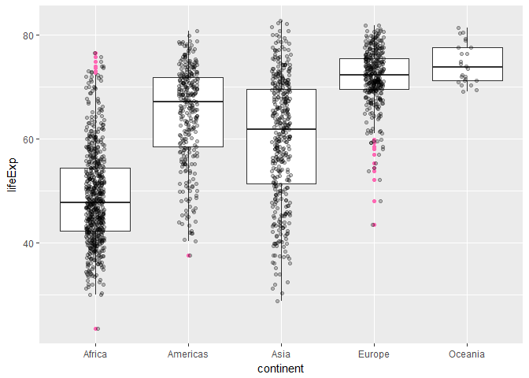
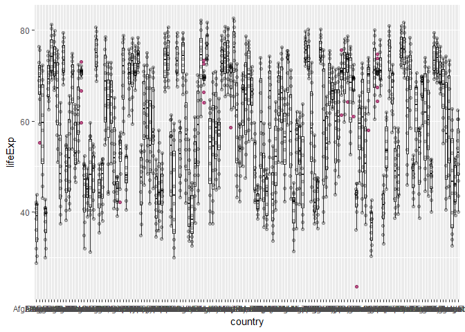
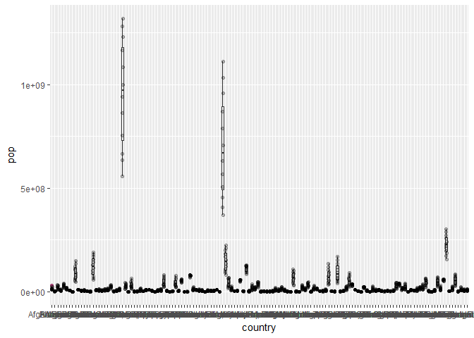
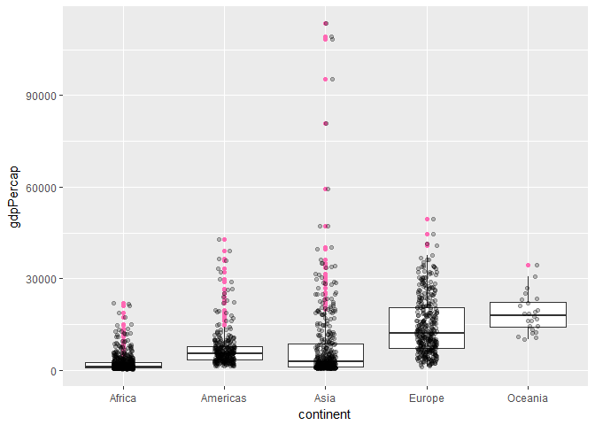
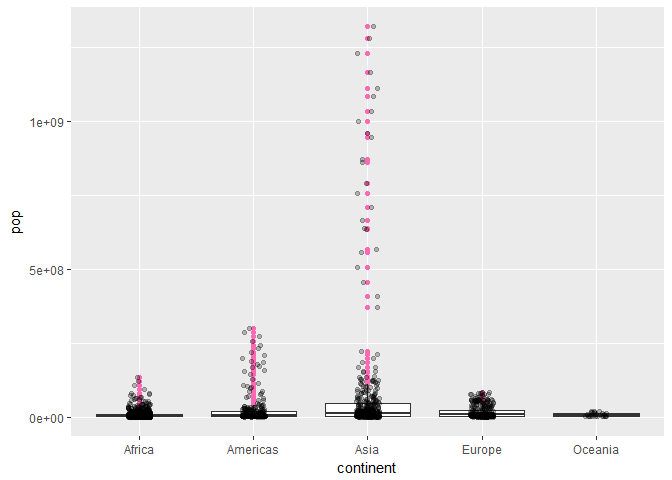
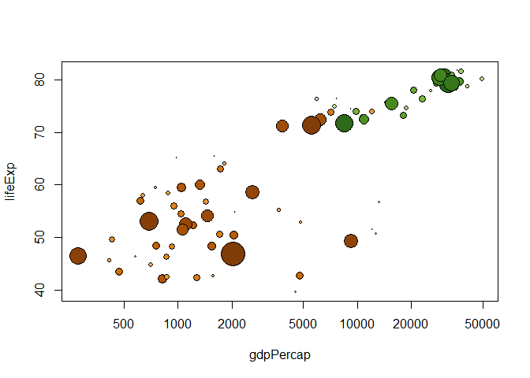
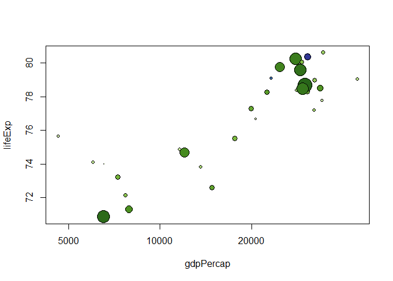
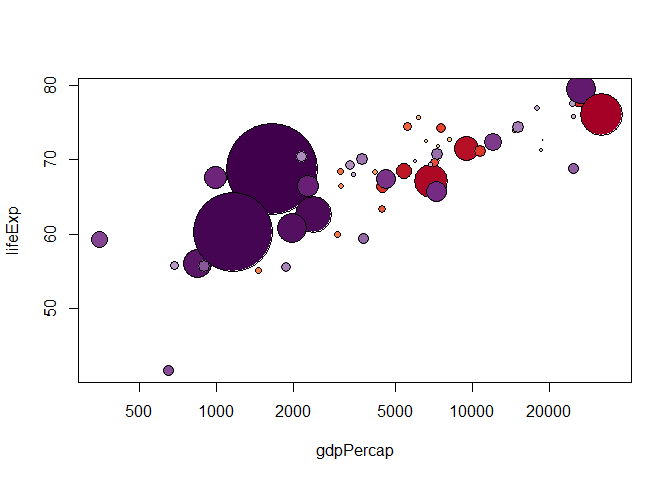

Homework 01 - ANSWER KEY
================
Melinda K. Higgins
January 29, 2017

**Homework 01 SETUP**
---------------------

1.  Create a Github repository for N741 Homework 1. Initialize it with a README file.
2.  In RStudio, create a new project for N741 Homework 1.
3.  Link RStudio to your Github repository for N741 homework 1.

Gapminder Example
-----------------

The following report is based on the R code examples at the **Gapminder** Github repository located at <https://github.com/jennybc/gapminder>.

Gapminder dataset - summary statistics
--------------------------------------

The `gapminder` dataset which is built into the `gapminder` package, has 6 variables and 1704 observations. We can list the variables in the dataset, using the `names()` function.

### Variables (columns) in gapminder dataset

``` r
names(gapminder)
```

    ## [1] "country"   "continent" "year"      "lifeExp"   "pop"       "gdpPercap"

### Structure of the gapminder dataset

Another way to see the "structure" of the dataset is to run the `str()` function.

``` r
str(gapminder)
```

    ## Classes 'tbl_df', 'tbl' and 'data.frame':    1704 obs. of  6 variables:
    ##  $ country  : Factor w/ 142 levels "Afghanistan",..: 1 1 1 1 1 1 1 1 1 1 ...
    ##  $ continent: Factor w/ 5 levels "Africa","Americas",..: 3 3 3 3 3 3 3 3 3 3 ...
    ##  $ year     : int  1952 1957 1962 1967 1972 1977 1982 1987 1992 1997 ...
    ##  $ lifeExp  : num  28.8 30.3 32 34 36.1 ...
    ##  $ pop      : int  8425333 9240934 10267083 11537966 13079460 14880372 12881816 13867957 16317921 22227415 ...
    ##  $ gdpPercap: num  779 821 853 836 740 ...

You'll notice that the 1st 2 columns/variables "country" and "continent" are both "Factor" type variables. Variables 3 and 5 "year" and "pop" are both "int" Integer type variables. Variables 4 and 6 "lifeExp" and "gdpPercap" are both "num" Numeric type variables.

### Summary Statistics of the gapminder dataset

The built in function `summary()` in base R does a good simple summary statistics for all variables in the dataset provided. Since this dataset only has 6 variable, we can simply call `summary(gapminder)` which will give us the summary statistics for all 6 variables.

``` r
summary(gapminder)
```

    ##         country        continent        year         lifeExp     
    ##  Afghanistan:  12   Africa  :624   Min.   :1952   Min.   :23.60  
    ##  Albania    :  12   Americas:300   1st Qu.:1966   1st Qu.:48.20  
    ##  Algeria    :  12   Asia    :396   Median :1980   Median :60.71  
    ##  Angola     :  12   Europe  :360   Mean   :1980   Mean   :59.47  
    ##  Argentina  :  12   Oceania : 24   3rd Qu.:1993   3rd Qu.:70.85  
    ##  Australia  :  12                  Max.   :2007   Max.   :82.60  
    ##  (Other)    :1632                                                
    ##       pop              gdpPercap       
    ##  Min.   :6.001e+04   Min.   :   241.2  
    ##  1st Qu.:2.794e+06   1st Qu.:  1202.1  
    ##  Median :7.024e+06   Median :  3531.8  
    ##  Mean   :2.960e+07   Mean   :  7215.3  
    ##  3rd Qu.:1.959e+07   3rd Qu.:  9325.5  
    ##  Max.   :1.319e+09   Max.   :113523.1  
    ## 

### Run specific statistic for a given variable

Suppose we only wanted to get the *mean* life expectancy. To do this we can use the built-in function `mean()`. To select only the "lifeExp" variable, we can either refer to it by which column it is in the dataset using `gapminder[,4]` which says to select all rows by leaving the 1st element between the `[]` before the comma blank and putting a 4 after the comman which specifies the 4th column. Another way to select a column is to use the name of that column which is "lifeExp" and use the dollar sign `$` selector to get `gapminder$lifeExp`.

``` r
mean(gapminder$lifeExp)
```

    ## [1] 59.47444

### In line code

We can use the same command above, but call it "inline" instead of as a separate code chunk which sets the output apart from the text in a separate section of the report. If you simply want the computation executed and the result inserted into the body of text you are writing you use "inline" code. To do this you use the following syntax *r mean(gapminder$lifeExp)* between the backtick marks \` \`. Using this syntax, we can write the following sentence.

The mean life expectancy is 59.4744394 years.

We can clean this up further by wrapping this command within the `round()` function and specifying the number of digits we want reported for this numeric result. This time, use the following command inline *r round(mean(gapminder$lifeExp), digits=2)* and we'll rewrite the sentence below.

The mean life expectancy is 59.47 years.

### **Homework 01 Exercise - Task 1**

Modify the sentence above to also provide the standard deviation, median and sample size for life expectancy, set `digits=2`.

Hint: Read help pages for the functions `sd()`, `median()`, and `length()`.

### Answer Homework 01 Task 1 - example

Here is some text to go with this example. I won't provide the answer here yet, but here is a similar worked example. See the above sentence and modify it to find the minimum and maximum life expectancy.

The minimum life expectancy is 23.6 years and the maximum life expectancy is 82.6.

=========================================
-----------------------------------------

ANSWER KEY - HOMEWORK 01 - TASK 1
---------------------------------

For this dataset with 1704 cases (i.e. "sample size"), the median life expectancy is 60.71 years and the standard deviation for life expectancy is 12.92.

=========================================
-----------------------------------------

### Look at a statistic by continent

Using the 1st code example at the `gapminder` Github repository at <https://github.com/jennybc/gapminder>, use the `aggregate()` command to see the median life expectancy by continent. You'll notice that the 1st variable listed is the "lifeExp" variable we want run "by" "continent". The "by" is indicated using the *tilde* symbol `~`. The 2nd variable listed is "continent" - this 2nd variable is usually a "factor-type" variable or group variable. *Hint: Try running lifeExp by year to get median lifeExp for each year.*

``` r
aggregate(lifeExp ~ continent, gapminder, median)
```

    ##   continent lifeExp
    ## 1    Africa 47.7920
    ## 2  Americas 67.0480
    ## 3      Asia 61.7915
    ## 4    Europe 72.2410
    ## 5   Oceania 73.6650

### **Homework 01 Exercise - Task 2**

Modify the r code chunk above to also provide the mean and standard deviation for life expectancy by continent.

### Answer Homework 01 Task 2 - example

Next copy to R code chunk above to find the minimum and maximum life expectancy by continent.

First the minimums.

``` r
aggregate(lifeExp ~ continent, gapminder, min)
```

    ##   continent lifeExp
    ## 1    Africa  23.599
    ## 2  Americas  37.579
    ## 3      Asia  28.801
    ## 4    Europe  43.585
    ## 5   Oceania  69.120

Next the maximums.

``` r
aggregate(lifeExp ~ continent, gapminder, max)
```

    ##   continent lifeExp
    ## 1    Africa  76.442
    ## 2  Americas  80.653
    ## 3      Asia  82.603
    ## 4    Europe  81.757
    ## 5   Oceania  81.235

=========================================
-----------------------------------------

ANSWER KEY - HOMEWORK 01 - TASK 2
---------------------------------

Mean life expectancy by continent.

``` r
aggregate(lifeExp ~ continent, gapminder, mean)
```

    ##   continent  lifeExp
    ## 1    Africa 48.86533
    ## 2  Americas 64.65874
    ## 3      Asia 60.06490
    ## 4    Europe 71.90369
    ## 5   Oceania 74.32621

The standard deviation for life expectancy by continent.

``` r
aggregate(lifeExp ~ continent, gapminder, sd)
```

    ##   continent   lifeExp
    ## 1    Africa  9.150210
    ## 2  Americas  9.345088
    ## 3      Asia 11.864532
    ## 4    Europe  5.433178
    ## 5   Oceania  3.795611

------------------------------------------------------------------------

*OPTIONAL - NOTE: In the "readme" vignette on Jenny Bryan's Github repository for the `gapminder` package <https://github.com/jennybc/gapminder>, in addition to using the `aggregate()` function which only allows 1 statistical function to be used at a time (at least in simple format), there is another option using the `summarise()` function from the `dplyr` package. The chunk below shows how to get both the mean and standard deviation together.*

``` r
# load the dplyr package
library(dplyr)
```

    ## 
    ## Attaching package: 'dplyr'

    ## The following objects are masked from 'package:stats':
    ## 
    ##     filter, lag

    ## The following objects are masked from 'package:base':
    ## 
    ##     intersect, setdiff, setequal, union

``` r
# these lines of code use the %>% "pipe" command we'll discuss
# in future classes. It also uses the group_by() function
# also in the dplyr package. The lines below can be read as
# "take the gapminder dataset, THEN group the data BY
# each continent THEN summarise each continent's mean and sd."
# I THEN sent the output to the kable function to output
# the results into a table.
gapminder %>%
    group_by(continent) %>%
    summarise(avgLifeExp = mean(lifeExp),
              sdLifeExp = sd(lifeExp)) %>%
    knitr::kable()
```

| continent |  avgLifeExp|  sdLifeExp|
|:----------|-----------:|----------:|
| Africa    |    48.86533|   9.150210|
| Americas  |    64.65874|   9.345088|
| Asia      |    60.06490|  11.864532|
| Europe    |    71.90369|   5.433178|
| Oceania   |    74.32621|   3.795611|

=========================================
-----------------------------------------

### Plot Life Expectancy by Continent

For the following plot, we will use the `ggplot2` package. Please be sure to install the package if you haven't already. Go to RStudio "Tools" menu and select "Install Packages" and type in "ggplot2". The R code chunk below will load the `ggplot2` package using the `library(ggplot2)` command. For now, we are using the code provided at the **Gapminder** Github repository located at <https://github.com/jennybc/gapminder>. We will explore and explain the ggplot syntax in further detail later this semester. For now, notice that in the `aes()` section of code below, there are 2 "aesthetics" provided to `ggplot()` - namely that `x = continent` and `y = lifeExp`. The code below generates 2 plots overlaid on top of each other. The 1st is a boxplot generated by `gemo_boxplot` and then a 2nd plot of "jittered" points is overlaid using the `geom_jitter()` command.

``` r
library(ggplot2)
ggplot(gapminder, aes(x = continent, y = lifeExp)) +
  geom_boxplot(outlier.colour = "hotpink") +
  geom_jitter(position = position_jitter(width = 0.1, height = 0), alpha = 1/4)
```



### **Homework 01 Exercise - Task 3**

Modify the R code chunk above to now produce two more plots: one for `gdpPercap` instead of `lifeExp` and one for `pop` instead of `lifeExp`. *Hint: change out the variable for `y` above. You will need the entire code chunk run twice - once for each different plot.*

### Answer Homework 01 Task 3 - example

Using the R code chunk above, let's modify it slightly and change the continents to country for the "x" aesthetic. Note: We do not have to reload the `ggplot` package - so the `library(ggplot2)` line of code is not needed.

``` r
ggplot(gapminder, aes(x = country, y = lifeExp)) +
  geom_boxplot(outlier.colour = "hotpink") +
  geom_jitter(position = position_jitter(width = 0.1, height = 0), alpha = 1/4)
```



We could do the code chunk again and change the "y" aesthetic to population.

``` r
ggplot(gapminder, aes(x = country, y = pop)) +
  geom_boxplot(outlier.colour = "hotpink") +
  geom_jitter(position = position_jitter(width = 0.1, height = 0), alpha = 1/4)
```



=========================================
-----------------------------------------

ANSWER KEY - HOMEWORK 01 - TASK 3
---------------------------------

**GDP Per Capita by Continent** - boxplots with jittered dots overlaid. *Pink dots indicate potential outliers.*

``` r
library(ggplot2)
ggplot(gapminder, aes(x = continent, y = gdpPercap)) +
  geom_boxplot(outlier.colour = "hotpink") +
  geom_jitter(position = position_jitter(width = 0.1, height = 0), alpha = 1/4)
```



**Population by Continent** - boxplots with jittered dots overlaid. *Pink dots indicate potential outliers.*

``` r
library(ggplot2)
ggplot(gapminder, aes(x = continent, y = pop)) +
  geom_boxplot(outlier.colour = "hotpink") +
  geom_jitter(position = position_jitter(width = 0.1, height = 0), alpha = 1/4)
```



=========================================
-----------------------------------------

### Selecting a Data subset and Customizing Plot Colors

For this next example, we will use the built-in "country\_colors" dataset defined in the `gapminder` package to create an updated data frame (cope of the `gapminder` dataset) called `gap_with_colors`. *NOTE: To see the built-in datasets in the `gapminder` package, type `data(package = "gapminder")` in the console.* After setting up the custom colors, the next line of R code defines which continents we plan to "keep" in our plot. This defines and object called `keepers` below. In this case, we are "keeping" Africa and Europe and the year 2007. So, we are subsetting the dataset for 2 countries and 1 year. Then the `plot()` command creates the scatterplot of life expectancy by GDP per capita with a dot representing each county within 2 continents (Africa and Europe) for only 2007. The size of each dot is represents a 3rd variable "pop" for population size.

``` r
# for convenience, integrate the country colors into the data.frame
gap_with_colors <-
  data.frame(gapminder,
             cc = I(country_colors[match(gapminder$country,
                                         names(country_colors))]))

# bubble plot, focus just on Africa and Europe in 2007
keepers <- with(gap_with_colors,
                continent %in% c("Africa", "Europe") & year == 2007)
plot(lifeExp ~ gdpPercap, gap_with_colors,
     subset = keepers, log = "x", pch = 21,
     cex = sqrt(gap_with_colors$pop[keepers]/pi)/1500,
     bg = gap_with_colors$cc[keepers])
```



### **Homework 01 Exercise - Task 4**

Modify the code chunk above to make a bubble plot for 2 other continents: Americas and Asia for the year 1992. *Hint: modify the variables listed in the "keepers" line of code for the 2 countries and the year.*

### Answer Homework 01 Task 4 - example

For a similar example, let's look at year 2002 and look at "Europe" and "Oceania" - copy of the code chunk from the `keepers` line forward and add the code chunk here.

``` r
# bubble plot, focus just on Africa and Europe in 2007
keepers <- with(gap_with_colors,
                continent %in% c("Europe","Oceania") & year == 2002)
plot(lifeExp ~ gdpPercap, gap_with_colors,
     subset = keepers, log = "x", pch = 21,
     cex = sqrt(gap_with_colors$pop[keepers]/pi)/1500,
     bg = gap_with_colors$cc[keepers])
```



=========================================
-----------------------------------------

ANSWER KEY - HOMEWORK 01 - TASK 4
---------------------------------

**Bubble Plot of Life Expectancy by GDP Per Capita for the Americas and Asia in 1992**

``` r
# bubble plot, now for the Americas and Asia in 1992
keepers <- with(gap_with_colors,
                continent %in% c("Americas", "Asia") & year == 1992)
plot(lifeExp ~ gdpPercap, gap_with_colors,
     subset = keepers, log = "x", pch = 21,
     cex = sqrt(gap_with_colors$pop[keepers]/pi)/1500,
     bg = gap_with_colors$cc[keepers])
```



=========================================
-----------------------------------------

### **Homework 01 Exercise - Task 5**

-   For your report, modify the YAML to put a good TITLE for your report and put in YOUR NAME and change the DATE.
-   If you have MiKTeX or MacTex installed and running on your computer, you can compile the report directly to PDF ("Knit to PDF"). However, if you didn't install these, you should still be able to "Knit to HTML" or "Knit to Word". Once you've got the HTML or Microsoft Word DOCX file created, you can print these to PDF.
-   Make sure your report completes the 4 tasks above with your associated R chunks along with a description or commentary on what you did and the result.
-   Submit the PDF homework using Canvas for N741.
-   Include in your report a link to your Github repository with your RMD file and any other associated output you created. In the body of your Rmarkdown (RMD) report use the `[]()` syntax to embed the URL "web link". For example, the link for this exercise is located at <https://github.com/melindahiggins2000/N741gapminder1> which was typed in to the Rmarkdown file as `[https://github.com/melindahiggins2000/N741gapminder1](https://github.com/melindahiggins2000/N741gapminder1)`.

### Answer Homework 01 Task 5 - example

My Github repository is located at <https://github.com/melindahiggins2000/N741gapminder1>.

=========================================
-----------------------------------------

ANSWER KEY - HOMEWORK 01 - TASK 5
---------------------------------

Everyone got their homework 01 saved to PDF and uploaded to CANVAS. And everyone emailed their Github accounts to us.

However, here are a few notes regarding what was seen in your Github accounts - observations only - these are not critiques - these are suggestions for improving your workflow as you move forward:

1.  I noticed some of you had multiple R projects (`*.Rproj`) files. You can have just 1 `*.Rproj` file since all this file has in it is the details on your R environment and project options including the link to the Github repository for that project. There should only be 1 R project for 1 Github Repository (for now).

2.  Everyone correctly forked a copy of the main `N741gapminder` Github repository (YEA!). However, there were a few who forgot to PUSH their final homework file(s) back up to their own repositories. In other words, for most of you I could see your homework files, but for a few I didn't see them. ALWAYS REMEMBER TO PUSH AND SAVE ALL YOUR FINAL WORK BACK TO GITHUB. Some people did have a copy of the PDF they submitted to CANVAS backed up in their Guthub repos, but the original generating RMD files were not there.

3.  There were a variety of ways people completed their homework. Some simply edited the original `GapminderMarkdown.Rmd` file and then turned that in as their homework. Other created a new RMD file (SaveAs) as something like `Homework 1.Rmd` or a variant file name. This is better since this really is a new file not just simply a version of the original.

### \*\* All in All - GOOD JOB EVERYONE \*\*

### `sessionInfo()`

**NOTE:** This RMD file was generated with the following `sessionInfo()`

``` r
sessionInfo()
```

    ## R version 3.3.2 (2016-10-31)
    ## Platform: x86_64-w64-mingw32/x64 (64-bit)
    ## Running under: Windows 10 x64 (build 14393)
    ## 
    ## locale:
    ## [1] LC_COLLATE=English_United States.1252 
    ## [2] LC_CTYPE=English_United States.1252   
    ## [3] LC_MONETARY=English_United States.1252
    ## [4] LC_NUMERIC=C                          
    ## [5] LC_TIME=English_United States.1252    
    ## 
    ## attached base packages:
    ## [1] stats     graphics  grDevices utils     datasets  methods   base     
    ## 
    ## other attached packages:
    ## [1] ggplot2_2.2.0   dplyr_0.5.0     gapminder_0.2.0
    ## 
    ## loaded via a namespace (and not attached):
    ##  [1] Rcpp_0.12.8      knitr_1.15.1     magrittr_1.5     munsell_0.4.3   
    ##  [5] colorspace_1.2-6 R6_2.1.3         stringr_1.1.0    highr_0.6       
    ##  [9] plyr_1.8.4       tools_3.3.2      grid_3.3.2       gtable_0.2.0    
    ## [13] DBI_0.5          htmltools_0.3.5  yaml_2.1.14      lazyeval_0.2.0  
    ## [17] assertthat_0.1   rprojroot_1.1    digest_0.6.10    tibble_1.2-12   
    ## [21] evaluate_0.10    rmarkdown_1.3    labeling_0.3     stringi_1.1.2   
    ## [25] scales_0.4.1     backports_1.0.4
